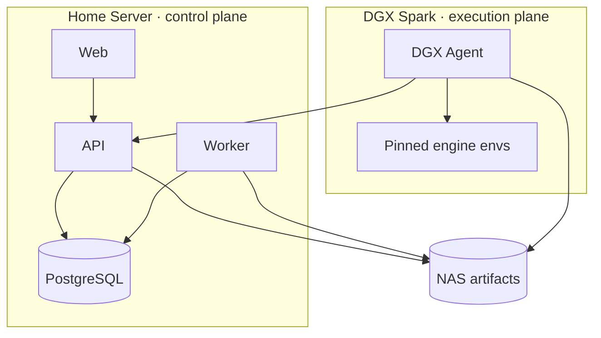
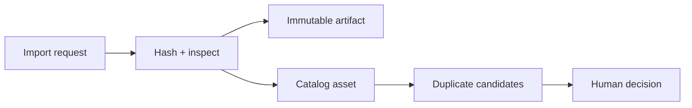
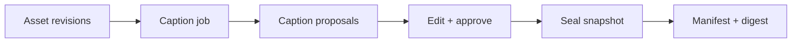
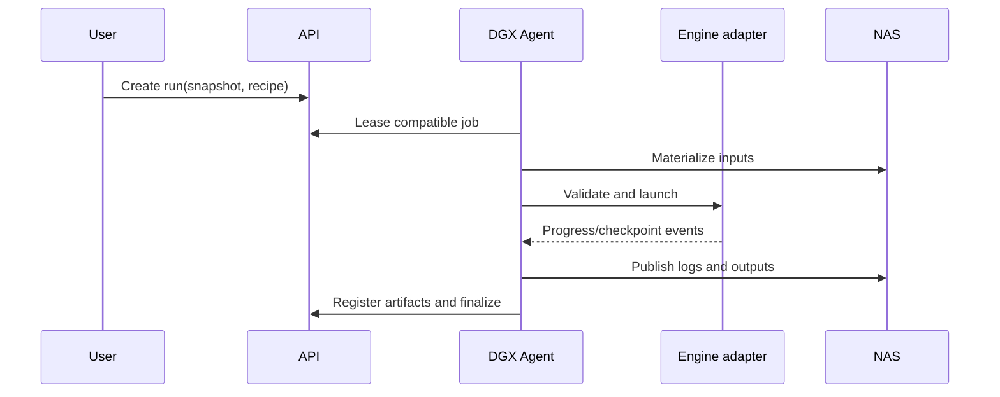

# 시스템 아키텍처와 데이터 흐름

## 아키텍처 원칙

1. PostgreSQL은 metadata의 source of truth이고 NAS는 immutable artifact의 source of truth다.
2. DB에는 machine-specific 절대 경로 대신 logical artifact URI를 저장한다.
3. API/Worker와 GPU engine의 Python 환경을 공유하지 않는다.
4. 장시간 작업은 at-least-once 실행을 전제로 lease, attempt, idempotency key를 사용한다.
5. 원본과 raw engine output을 보존하고, 검색·비교용 normalized view를 별도로 만든다.
6. 데이터셋 snapshot과 완료된 run manifest는 수정하지 않는다.

## 배포 단위



### Web

- 데이터셋, 캡션 검수, 학습 실행, 비교, 평가 화면을 제공한다.
- generated API client만 사용하고 DB/NAS에 직접 접근하지 않는다.
- 큰 artifact는 API가 발급한 제한된 download route를 통해 읽는다.

### API

- 동기 command/query, validation, service authentication과 OpenAPI를 소유한다.
- job 생성, snapshot seal, caption approval과 같은 상태 전이를 domain rule로 검증한다.
- artifact 다운로드 시 logical URI를 storage adapter로 해석한다.

### Worker

- thumbnail, hash, manifest 작성, metadata 추출, 정리 후보 계산 등 control-plane background job을 수행한다.
- GPU를 전제로 하지 않는다.
- 외부 engine을 직접 실행하지 않는다.

### DGX Agent

- capability, engine adapter version, 가용 자원을 API에 등록하고 heartbeat를 보낸다.
- 실행 가능한 job을 lease하고 고정된 engine environment에서 subprocess로 실행한다.
- 입력을 local scratch에 materialize하고 결과를 NAS에 원자적으로 publish한다.
- engine log와 normalized event를 전송하며 lease 상실 시 새 결과를 current로 승격하지 않는다.

### NAS

- original, derived image, caption export, dataset snapshot, model, checkpoint, log, workflow, generation output을 보관한다.
- catalog entry는 `nas://<namespace>/<key>`를 사용한다.
- 각 배포는 namespace별 실제 mount root를 환경 설정으로 매핑한다.

## 계획된 코드 구조

```text
apps/
  web/                         React/Vite SPA
services/
  api/                         FastAPI composition root
  worker/                      control-plane background process
  dgx-agent/                   execution protocol and engine adapters
packages/
  python/
    domain/                    entities, value objects, invariants
    application/               use cases and ports
    persistence/               SQLAlchemy repositories, Alembic
    artifact-store/            logical URI and NAS implementation
  typescript/
    api-client/                generated OpenAPI client
contracts/
  schemas/                     versioned durable JSON schemas
  examples/                    contract fixtures
ops/
  dev/                         local-only compose and seed config
tools/                         deterministic maintenance scripts
docs/
  adr/
```

서비스별 Dockerfile은 해당 서비스 코드와 함께 이 저장소에 둔다. 실제 host, volume, secret, reverse proxy, restart policy를 묶는 프로덕션 배포 구성은 `qortlr100/homeserver`가 소유한다.

## Artifact namespace

초기 logical layout은 물리 폴더 구조와 분리한다.

```text
nas://assets/original/<sha256-prefix>/<sha256>
nas://assets/derived/<sha256-prefix>/<sha256>
nas://datasets/<dataset-id>/snapshots/<snapshot-id>/
nas://runs/training/<run-id>/attempts/<attempt-id>/
nas://runs/generation/<run-id>/
nas://models/<model-id>/<revision-id>/
nas://workflows/<workflow-id>/<revision-id>.json
```

Artifact publish는 임시 key에 완전히 쓴 뒤 hash와 size를 검증하고 final key로 rename하는 방식으로 원자성을 확보한다. DB row 작성과 NAS rename은 단일 transaction이 아니므로 `pending → available` 상태와 repair job을 사용한다.

## 데이터 흐름

### 1. 이미지 수집과 중복 검사



1. import source를 읽되 원본을 수정하지 않는다.
2. SHA-256, byte size, media type, dimensions와 perceptual hash를 계산한다.
3. 동일 SHA-256이면 새 blob을 쓰지 않고 provenance만 추가한다.
4. 유사 hash는 `DuplicateCandidate`를 만들며 자동 삭제하거나 자동 병합하지 않는다.
5. thumbnail은 derived artifact로 별도 등록한다.

### 2. 캡셔닝과 snapshot



- caption adapter 입력에는 model ID/revision, prompt/template, thresholds, seed와 runtime fingerprint가 포함된다.
- engine 원문 출력과 normalized tags/text를 모두 보존한다.
- 편집은 새 `CaptionRevision`을 만들고 승인 상태를 기록한다.
- seal 시 선택된 asset digest와 caption revision을 canonical JSON으로 직렬화해 snapshot digest를 계산한다.
- seal 이후 변경은 새 snapshot으로만 반영한다.

### 3. 학습 실행



- `TrainingRecipeRevision`은 사용자 의도와 공통 옵션을 저장하고, adapter가 immutable engine input bundle로 변환한다.
- bundle에는 adapter ID/version, engine source revision, environment digest, rendered config와 command argv가 포함된다.
- shell string을 조립하지 않고 argument array로 실행한다.
- 재시도마다 `RunAttempt`가 추가되며 기존 attempt 결과를 덮어쓰지 않는다.
- checkpoint 발견은 normalized event로 등록하고 파일 hash 검증 뒤 비교에 사용할 수 있게 한다.

### 4. ComfyUI 결과 ingest와 피드백

1. PNG metadata 또는 별도 JSON에서 raw workflow와 prompt를 가져온다.
2. raw workflow artifact를 보존하고 normalization version과 fingerprint를 생성한다.
3. 모델·LoRA 이름만 있는 경우 catalog candidate로 남기며 hash가 확인되기 전에는 확정 연결하지 않는다.
4. generation run은 정확한 model/checkpoint artifact, strength, seed와 sampler 설정을 참조한다.
5. 비교 세트는 baseline과 변수 축을 명시한다. 여러 변수가 동시에 달라지면 UI가 경고한다.
6. 평가는 immutable revision으로 기록한다.
7. dataset candidate 등록은 원본 generation provenance를 유지하고 별도 사람 승인을 요구한다.

## Job protocol

초기에는 별도 message broker 없이 PostgreSQL durable queue와 API lease protocol을 사용한다.

- 상태: `queued`, `leased`, `running`, `succeeded`, `failed`, `cancel_requested`, `cancelled`
- lease에는 owner agent, expiry, attempt와 heartbeat가 있다.
- 같은 idempotency key의 완료 작업은 다시 current 결과를 만들지 않는다.
- Agent는 capability 조건에 맞는 작업만 claim한다.
- cancellation은 cooperative이며 engine 종료 후 partial artifact도 attempt 아래 보존할 수 있다.
- 장시간 연결에 의존하지 않고 polling부터 시작하며, 이후 server-sent events는 UI 편의 기능으로 추가한다.

Redis/Celery 또는 NATS는 queue throughput, scheduling latency, fan-out이 실제 병목으로 측정될 때 도입한다.

## 장애 처리

| 장애 | 처리 |
|---|---|
| Agent heartbeat 중단 | lease 만료 후 새 attempt로 재시도 |
| NAS write 중단 | temporary artifact 정리 후보, DB는 `pending` 유지 |
| DB commit 전 NAS publish 완료 | reconciliation이 digest로 복구 또는 quarantine |
| 중복 완료 보고 | idempotency key와 attempt 상태로 한 번만 승격 |
| engine 로그 parser 실패 | raw log 보존, 상태를 `needs_attention`으로 표시 |
| workflow의 모델 식별 불가 | unresolved reference로 ingest하고 수동 연결 허용 |

## 보안

- 브라우저 인증은 homeserver reverse proxy와 API session/token 경계를 함께 사용한다.
- Agent token은 browser token과 분리하고 최소 scope를 가진다.
- NAS root는 API 요청으로 전달하지 않고 배포 설정에서만 해석한다.
- import 경로는 허용된 inbox root 하위인지 canonicalize 후 확인한다.
- subprocess는 shell을 거치지 않고 timeout, signal, working directory와 환경 allowlist를 명시한다.
- secret 값은 config snapshot과 로그에서 redact한다.
